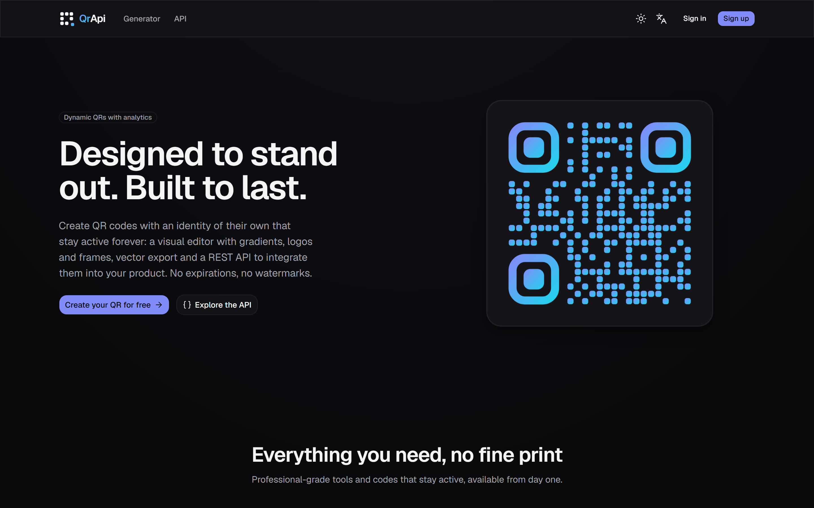
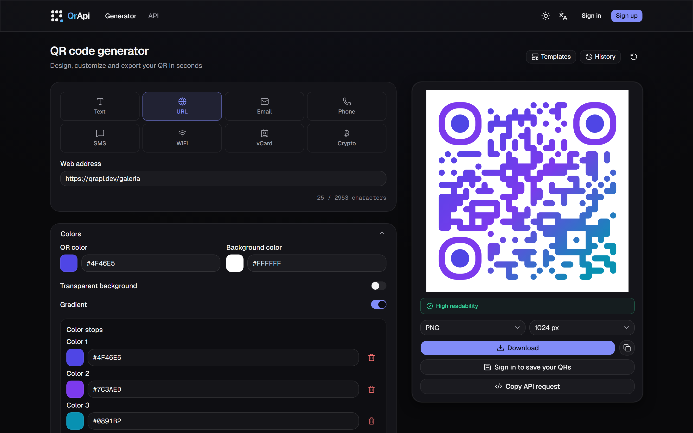
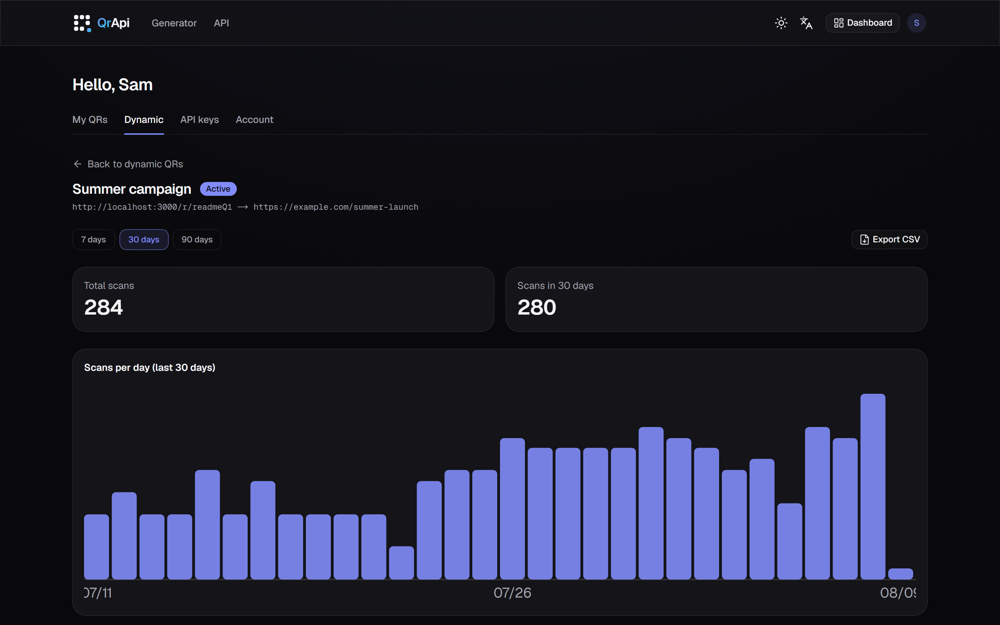
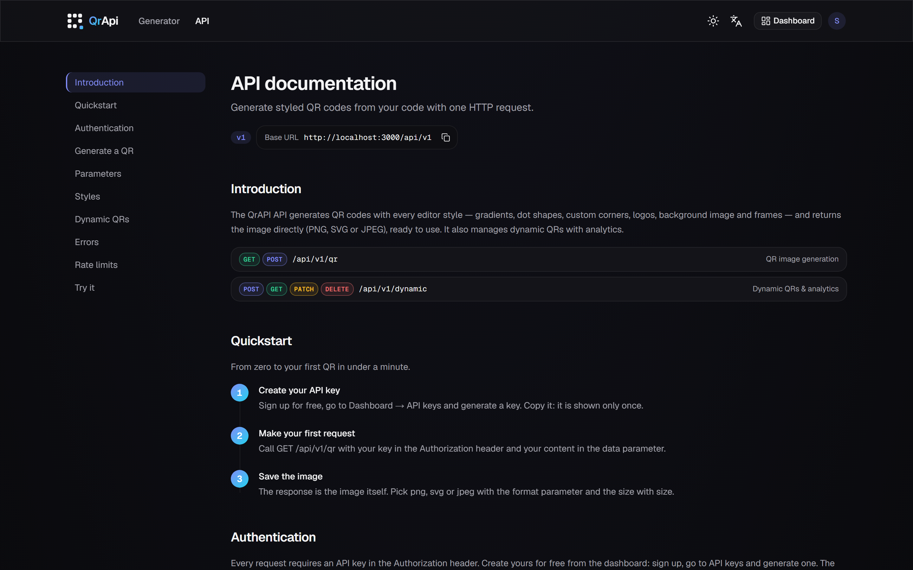

<div align="center">

# QrAPI

**Forge QR codes that don't look like QR codes.**
*Forja códigos QR que no parecen códigos QR.*

Visual QR editor, dynamic QR codes with scan analytics, and a REST API for developers.


[English](#english) · [Español](#español)



</div>

---

## English

### Table of contents

- [Features](#features)
- [The visual editor](#the-visual-editor)
- [Dynamic QRs with analytics](#dynamic-qrs-with-analytics)
- [Public REST API](#public-rest-api)
- [Quick start (development)](#quick-start-development)
- [Environment variables](#environment-variables)
- [Scripts](#scripts)
- [Architecture (summary)](#architecture-summary)
- [Tests](#tests)

### Features

- **Live visual editor** — instant preview with crossfade, 8 content types, 20 ready-made templates and ~30 style controls.
- **Dynamic QR codes** — a printed code whose destination you can change anytime, with pause, optional password protection and per-scan analytics.
- **True export** — pure vector SVG (not an embedded PNG), PNG/JPG up to 4096 px, print-ready PDF and copy-to-clipboard. All generated in your browser.
- **Public REST API** — generate styled QR images and manage dynamic QRs from your code, with per-user tokens and rate limiting. Docs with a live playground at `/en/docs/api`.
- **History & library** — last 20 QRs in localStorage for guests; registered users get a persistent library (up to 100) with automatic one-time migration.
- **Bilingual (ES/EN)**, dark & light themes, accessible (WCAG AA), zero telemetry.

### The visual editor



- **8 content types** with dedicated forms that produce the correct standard format: URL, text, email (`mailto:`), phone (`tel:`), SMS (`SMSTO:`), WiFi (`WIFI:T:...;;`), vCard 3.0 and crypto (`bitcoin:`/`ethereum:`) — with proper escaping and inline validation.
- **10 dot styles** (square, dots, rounded, classy, extra-rounded, vertical/horizontal line, star, plus, diamond) with neighbor-aware rounding, **6 corner square styles** and **4 corner dot styles**.
- **Linear and radial gradients** with presets, applicable independently to dots, corners and background.
- **Background image** (PNG/JPEG/WebP) with adjustable opacity and finder plates tinted by sampling the image; error correction is automatically raised to level H.
- **Centered logo** with real module excavation and configurable size/margin.
- **10 decorative text frames** (modern, classic, neon, minimal, elegant, speech bubble, badge, ticket, scanner brackets, banner) with top/bottom position, auto-shrinking font and automatic text contrast.
- **Effects**: inverted colors, glow and opacity. Plus error correction level (L/M/Q/H) and quiet zone control.
- **20 templates** in 5 categories (brand, dark, business, marketing, industry) applied with one click.
- **Live scanability indicator** — warns when contrast or logo size may break scanning, using real WCAG contrast math.
- **Keyboard shortcuts** and a **"Copy API request"** dialog that turns your current design into ready-to-use curl / JavaScript / Python snippets.

### Dynamic QRs with analytics



A dynamic QR encodes a short redirect URL (`/r/{slug}`) owned by you. The printed code never changes — its destination does:

- **Edit the destination anytime** without regenerating or reprinting; **pause and resume** the code with one switch.
- **Optional scan password**: visitors see a bilingual interstitial and must enter a password before being redirected (scrypt-hashed, brute-force rate-limited: 5/min and 100/day per code).
- **Per-scan analytics**: country, device type, OS, browser and referrer, with a scans-per-day chart over 7/30/90 days and breakdown tables.
- **Privacy by design**: IPs are never stored — only an HMAC-SHA256 hash (`SCAN_IP_SECRET`); recording happens after the redirect so scans are never slowed down.
- **CSV export** of the full scan history.
- Manage everything from **Dashboard → Dynamic** or via the API (below). Limit: 100 dynamic QRs per account.

The dashboard also includes your static QR library, API key management (up to 10 active keys) and account settings (profile, password change, account deletion).

### Public REST API



```bash
curl "http://localhost:3000/api/v1/qr?data=hello&format=png&size=512&dotsStyle=rounded" \
  -H "Authorization: Bearer qra_YOUR_TOKEN" -o qr.png
```

| Endpoint | Description |
|---|---|
| `GET /api/v1/qr` | Generate a QR from flat query params — returns the image |
| `POST /api/v1/qr` | Generate with the full config (gradients, logo, background image, effects, structured payloads) |
| `POST /api/v1/dynamic` | Create a dynamic QR (`title`, `targetUrl`) |
| `GET /api/v1/dynamic` | List your dynamic QRs with scan counts |
| `GET /api/v1/dynamic/{id}` | Detail + aggregated analytics by country and device |
| `PATCH /api/v1/dynamic/{id}` | Edit `targetUrl` and/or `active` without regenerating the code |
| `DELETE /api/v1/dynamic/{id}` | Delete the dynamic QR and its scan history |

- **Formats**: `png` (default), `svg`, `jpeg` · **size** 64–2048 px. GET covers the common styles; the advanced ones (gradients, logo, background image, effects, structured `payload`) are POST-only.
- **Auth**: `Authorization: Bearer qra_...`. Tokens are shown once at creation; only their SHA-256 hash is stored.
- **Rate limiting**: 60/min and 5000/day per key (configurable), with `X-RateLimit-*` headers and JSON errors — always `{"error":{"code","message"}}`.

Sign up, create a token under **Dashboard → API keys**, and read the full documentation at `/en/docs/api` — parameters, styles, dynamic QRs, errors and a **live playground** to try requests with your key.

### Quick start (development)

Requirements: Node.js 20+, Docker Desktop.

```bash
git clone https://github.com/Sam-SSD/QrApi.git
cd QrApi
npm install

# 1. Copy the env vars and generate a secret
cp .env.example .env
# edit .env: set BETTER_AUTH_SECRET to the output of:
#   node -e "console.log(crypto.randomBytes(32).toString('base64'))"

# 2. Start Postgres + Mailpit (dev SMTP)
npm run db:up

# 3. Apply migrations
npm run db:migrate

# 4. Run
npm run dev
```

- App: http://localhost:3000
- Mailpit (dev verification emails): http://localhost:8025

### Environment variables

| Variable | Required | Description |
|---|---|---|
| `DATABASE_URL` | Yes | Postgres connection (compose maps host port **5433**) |
| `BETTER_AUTH_SECRET` | Yes | Session secret (min. 32 chars) |
| `BETTER_AUTH_URL` | No | Public app URL (default `http://localhost:3000`) |
| `NEXT_PUBLIC_SITE_URL` | No | Public base URL for docs, `/r/{slug}` and metadata (inlined at build time — changing it requires a rebuild) |
| `SMTP_HOST/PORT/FROM` | No (dev: Mailpit) | Verification email delivery; `SMTP_USER/PASSWORD` optional |
| `AUTH_REQUIRE_EMAIL_VERIFICATION` | No | Default `true`. Keep it on outside local development |
| `GITHUB_CLIENT_ID/SECRET` | No | Enables GitHub login |
| `GOOGLE_CLIENT_ID/SECRET` | No | Enables Google login |
| `RATE_LIMIT_PER_MINUTE` / `RATE_LIMIT_PER_DAY` | No | API limits per key (default 60 / 5000) |
| `SCAN_IP_SECRET` | No (dev default) | Secret for hashing IPs in scan events — set a real one in production |

All variables are validated with zod at boot (`src/env.ts`). In production the schema additionally enforces `https://` URLs, a non-dev `SCAN_IP_SECRET` and a non-localhost site URL.

### Scripts

| Script | Description |
|---|---|
| `npm run dev` | Development server (Turbopack) |
| `npm run build` / `start` | Production build / start (`start` applies pending migrations first) |
| `npm test` / `test:watch` | Tests (QR engine verified with real ZXing decoding) |
| `npm run lint` / `typecheck` / `format` | Code quality |
| `npm run db:up` / `db:down` | Start / stop Postgres + Mailpit |
| `npm run db:migrate` / `db:deploy` / `db:studio` | Migrations (dev / prod) and Prisma Studio |

### Architecture (summary)

The core is an **isomorphic SVG QR engine** (`src/lib/qr/`): the `qrcode` package provides only the module matrix; a custom renderer turns it into SVG (dots, gradients, corners, logo, background image, frames, effects). The editor injects that SVG into the DOM; the public API rasterizes the exact same string with sharp. **One config renders pixel-identical in both worlds**, and SVG export is truly vector.

Dynamic QRs live on `/r/{slug}` (8-char base62 slugs): the route redirects immediately and records the scan afterwards (`after()`), so analytics never delay the visitor. Rate limiting uses fixed windows stored in Postgres via an atomic UPSERT — no Redis, safe across instances.

### Tests

`npm test` asserts **real scanability**: each rendered SVG is rasterized with sharp and decoded with zxing-wasm — covering all 10 dot styles, all corner styles, the 10 frames, gradients, logo excavation, background images and the 20 templates — plus the 8 payload formats and their escaping, slug generation, scan password hashing (scrypt) and user-agent parsing.

---

## Español

### Tabla de contenidos

- [Características](#características)
- [El editor visual](#el-editor-visual)
- [QR dinámicos con analítica](#qr-dinámicos-con-analítica)
- [API REST pública](#api-rest-pública)
- [Empezar en 5 minutos](#empezar-en-5-minutos)
- [Variables de entorno](#variables-de-entorno)
- [Scripts](#scripts-1)
- [Arquitectura (resumen)](#arquitectura-resumen)
- [Tests](#tests-1)

### Características

- **Editor visual en vivo** — preview instantánea con crossfade, 8 tipos de contenido, 20 plantillas listas y ~30 controles de estilo.
- **QR dinámicos** — un código impreso cuyo destino puedes cambiar cuando quieras, con pausa, protección opcional por contraseña y analítica por escaneo.
- **Exportación de verdad** — SVG vectorial puro (no un PNG embebido), PNG/JPG hasta 4096 px, PDF listo para imprimir y copiar al portapapeles. Todo generado en tu navegador.
- **API REST pública** — genera imágenes QR con estilo y gestiona QR dinámicos desde tu código, con tokens por usuario y rate limiting. Docs con playground en vivo en `/es/docs/api`.
- **Historial y biblioteca** — los últimos 20 QRs en localStorage para invitados; con cuenta, biblioteca persistente (hasta 100) y migración automática única.
- **Bilingüe (ES/EN)**, tema oscuro y claro, accesible (WCAG AA) y sin telemetría.

### El editor visual

- **8 tipos de contenido** con formularios dedicados que generan el formato estándar correcto: URL, texto, email (`mailto:`), teléfono (`tel:`), SMS (`SMSTO:`), WiFi (`WIFI:T:...;;`), vCard 3.0 y crypto (`bitcoin:`/`ethereum:`) — con escapado correcto y validación inline.
- **10 estilos de puntos** (cuadrado, puntos, redondeado, classy, extra-redondeado, línea vertical/horizontal, estrella, cruz, diamante) con redondeo consciente de vecinos, **6 estilos de esquina cuadrada** y **4 de punto de esquina**.
- **Gradientes lineales y radiales** con presets, aplicables por separado a puntos, esquinas y fondo.
- **Imagen de fondo** (PNG/JPEG/WebP) con opacidad ajustable y placas de los finders tintadas muestreando la imagen; la corrección de errores sube automáticamente a nivel H.
- **Logo centrado** con excavación real de módulos y tamaño/margen configurables.
- **10 marcos decorativos con texto** (modern, classic, neon, minimal, elegant, bocadillo, badge, ticket, corchetes de escáner, banner) con posición arriba/abajo, fuente que se auto-reduce y contraste de texto automático.
- **Efectos**: colores invertidos, glow y opacidad. Además nivel de corrección (L/M/Q/H) y zona de silencio configurable.
- **20 plantillas** en 5 categorías (marca, dark, negocios, marketing, industria) que se aplican con un clic.
- **Indicador de escaneabilidad en vivo** — avisa si el contraste o el tamaño del logo comprometen la lectura, con cálculo de contraste WCAG real.
- **Atajos de teclado** y un diálogo **"Copiar request API"** que convierte tu diseño actual en snippets curl / JavaScript / Python listos para usar.

### QR dinámicos con analítica

Un QR dinámico codifica una URL corta de redirección (`/r/{slug}`) tuya. El código impreso nunca cambia — su destino sí:

- **Edita el destino cuando quieras** sin regenerar ni reimprimir; **pausa y reanuda** el código con un interruptor.
- **Contraseña de escaneo opcional**: quien escanea ve una página intersticial bilingüe y debe introducir la contraseña antes de la redirección (hash scrypt, con rate limit anti fuerza bruta: 5/min y 100/día por código).
- **Analítica por escaneo**: país, tipo de dispositivo, OS, navegador y referrer, con gráfica de escaneos por día en rangos de 7/30/90 días y tablas de desglose.
- **Privacidad por diseño**: nunca se guarda la IP — solo un hash HMAC-SHA256 (`SCAN_IP_SECRET`); el registro ocurre después de la redirección, así que el escaneo nunca se ralentiza.
- **Export CSV** del historial completo de escaneos.
- Gestiona todo desde **Panel → Dinámicos** o vía API (abajo). Límite: 100 QR dinámicos por cuenta.

El panel incluye además tu biblioteca de QRs estáticos, la gestión de claves API (hasta 10 activas) y los ajustes de cuenta (perfil, cambio de contraseña, borrado de cuenta).

### API REST pública

```bash
curl "http://localhost:3000/api/v1/qr?data=hola&format=png&size=512&dotsStyle=rounded" \
  -H "Authorization: Bearer qra_TU_TOKEN" -o qr.png
```

| Endpoint | Descripción |
|---|---|
| `GET /api/v1/qr` | Genera un QR con query params planos — devuelve la imagen |
| `POST /api/v1/qr` | Genera con la config completa (gradientes, logo, imagen de fondo, efectos, payloads estructurados) |
| `POST /api/v1/dynamic` | Crea un QR dinámico (`title`, `targetUrl`) |
| `GET /api/v1/dynamic` | Lista tus QR dinámicos con sus contadores de escaneos |
| `GET /api/v1/dynamic/{id}` | Detalle + analítica agregada por país y dispositivo |
| `PATCH /api/v1/dynamic/{id}` | Edita `targetUrl` y/o `active` sin regenerar el código |
| `DELETE /api/v1/dynamic/{id}` | Borra el QR dinámico y su historial de escaneos |

- **Formatos**: `png` (default), `svg`, `jpeg` · **size** 64–2048 px. GET cubre los estilos comunes; los avanzados (gradientes, logo, imagen de fondo, efectos, `payload` estructurado) son solo por POST.
- **Auth**: `Authorization: Bearer qra_...`. El token se muestra una única vez al crearlo; solo se guarda su hash SHA-256.
- **Rate limiting**: 60/min y 5000/día por clave (configurable), con cabeceras `X-RateLimit-*` y errores JSON — siempre `{"error":{"code","message"}}`.

Regístrate, crea tu token en **Panel → Claves API** y consulta la documentación completa en `/es/docs/api` — parámetros, estilos, QR dinámicos, errores y un **playground en vivo** para probar requests con tu clave.

### Empezar en 5 minutos

Requisitos: Node.js 20+, Docker Desktop.

```bash
git clone https://github.com/Sam-SSD/QrApi.git
cd QrApi
npm install

# 1. Copia las variables de entorno y genera un secret
cp .env.example .env
# edita .env: BETTER_AUTH_SECRET con el resultado de:
#   node -e "console.log(crypto.randomBytes(32).toString('base64'))"

# 2. Levanta Postgres + Mailpit (SMTP de desarrollo)
npm run db:up

# 3. Aplica las migraciones
npm run db:migrate

# 4. Arranca
npm run dev
```

- App: http://localhost:3000
- Mailpit (emails de verificación en dev): http://localhost:8025

### Variables de entorno

| Variable | Obligatoria | Descripción |
|---|---|---|
| `DATABASE_URL` | Sí | Conexión Postgres (el compose usa el puerto **5433**) |
| `BETTER_AUTH_SECRET` | Sí | Secret de sesiones (mín. 32 chars) |
| `BETTER_AUTH_URL` | No | URL pública de la app (default `http://localhost:3000`) |
| `NEXT_PUBLIC_SITE_URL` | No | URL base pública para docs, `/r/{slug}` y metadatos (se inserta en el build — cambiarla requiere rebuild) |
| `SMTP_HOST/PORT/FROM` | No (dev: Mailpit) | Envío de emails de verificación; `SMTP_USER/PASSWORD` opcionales |
| `AUTH_REQUIRE_EMAIL_VERIFICATION` | No | Default `true`. Mantenla activa fuera de desarrollo local |
| `GITHUB_CLIENT_ID/SECRET` | No | Activa login con GitHub |
| `GOOGLE_CLIENT_ID/SECRET` | No | Activa login con Google |
| `RATE_LIMIT_PER_MINUTE` / `RATE_LIMIT_PER_DAY` | No | Límites de la API por clave (default 60 / 5000) |
| `SCAN_IP_SECRET` | No (default de dev) | Secret para hashear IPs en los escaneos — pon uno real en producción |

Todas las variables se validan con zod al arrancar (`src/env.ts`). En producción el schema exige además URLs `https://`, un `SCAN_IP_SECRET` que no sea el de desarrollo y una URL pública sin localhost.

### Scripts

| Script | Descripción |
|---|---|
| `npm run dev` | Desarrollo con Turbopack |
| `npm run build` / `start` | Build / arranque de producción (`start` aplica las migraciones pendientes primero) |
| `npm test` / `test:watch` | Tests (motor QR verificado con decodificación ZXing real) |
| `npm run lint` / `typecheck` / `format` | Calidad de código |
| `npm run db:up` / `db:down` | Levantar / parar Postgres + Mailpit |
| `npm run db:migrate` / `db:deploy` / `db:studio` | Migraciones (dev / prod) y Prisma Studio |

### Arquitectura (resumen)

El corazón es un **motor QR SVG isomorfo** (`src/lib/qr/`): el paquete `qrcode` aporta solo la matriz de módulos y un renderer propio la convierte en SVG (puntos, gradientes, esquinas, logo, imagen de fondo, marcos, efectos). El editor inyecta ese SVG en el DOM; la API pública rasteriza exactamente la misma cadena con sharp. **Un mismo config genera un QR idéntico píxel a píxel en ambos mundos**, y el export SVG es vectorial de verdad.

Los QR dinámicos viven en `/r/{slug}` (slugs base62 de 8 caracteres): la ruta redirige de inmediato y registra el escaneo después (`after()`), así la analítica nunca retrasa al visitante. El rate limiting usa ventanas fijas en Postgres con UPSERT atómico — sin Redis, seguro con varias instancias.

### Tests

`npm test` verifica **escaneabilidad real**: cada SVG renderizado se rasteriza con sharp y se decodifica con zxing-wasm — cubriendo los 10 estilos de puntos, todos los de esquinas, los 10 marcos, gradientes, excavación de logo, imágenes de fondo y las 20 plantillas — además de los 8 formatos de payload y su escapado, la generación de slugs, el hash de contraseñas de escaneo (scrypt) y el parseo de user-agents.

---

## Licencia / License

Software propietario · Todos los derechos reservados.
Proprietary software · All rights reserved.
